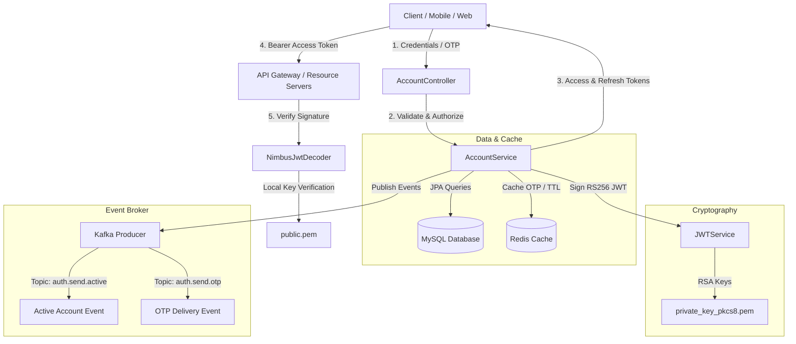

# 🔐 Furniro - Authentication & Identity Service

[](https://spring.io/projects/spring-boot)
[](https://www.oracle.com/java/)
[](https://redis.io)
[](https://kafka.apache.org)
[](LICENSE)

The **Authentication Service** is the central security gateway and identity management hub of the **Furniro E-Commerce Ecosystem**. Built with Spring Boot 3, it provides robust identity verification, secure token-based authentication (RS256 JWT), session caching, Role-Based Access Control (RBAC), and event-driven microservices synchronization.

---

## 🏗️ Core Architecture & Flow

The microservice leverages a decoupled security design. It uses an **asymmetric RS256 algorithm** to sign JSON Web Tokens, enabling downstream services to verify user identity autonomously using only the public key.



---

## 🌟 Key Highlights

- 🔑 **Secure Authentication Flow**: Fully encrypted password storage using `BCryptPasswordEncoder` and custom username generation.
- 🎟️ **Asymmetric Cryptography**: RS256 (RSA with SHA-256) signature scheme using 2048-bit keys for decoupled, highly scalable downstream verification.
- 🛡️ **Granular Access Control (RBAC)**: Fine-grained method-level security with `@PreAuthorize` securing endpoints based on `ADMIN` or `CUSTOMER` roles.
- ⚡ **Redis Session & OTP Engine**: Microsecond-fast caching of One-Time Passwords (OTP) with built-in time-to-live (TTL) expiration.
- 📡 **Event-Driven Integration**: Publishes system registration and verification events to Apache Kafka topics (`auth.send.active`, `auth.send.otp`) to drive decoupled notification services.
- 📖 **Self-Documenting API**: Fully integrated OpenAPI 3.0 / Swagger UI for developer-friendly sandbox testing.

---

## 🛠️ Technology Stack

| Component | Technology | Version / Specification |
| :--- | :--- | :--- |
| **Framework** | Spring Boot | `3.4.x` (Starter parent) |
| **Runtime** | Java OpenJDK | `17` |
| **Database** | MySQL | `8.x` / Hibernate JPA |
| **Cache Store** | Redis | `6.x+` (via Spring Session Data Redis) |
| **Event Broker** | Apache Kafka | `3.x` (Spring Kafka) |
| **Security Core** | Spring Security | OAuth2 Resource Server (Nimbus JWT) |
| **Token Spec** | JSON Web Token | `io.jsonwebtoken (jjwt-api)` `0.13.0` |
| **JSON Parser** | Jackson | `2.x` |
| **Utility** | MapStruct / Lombok | `1.6.3` / `1.18.36` |

---

## 🚀 Getting Started

### Prerequisites

Before running the service, ensure you have:
- **JDK 17** installed.
- **Maven 3.8+** installed.
- **MySQL 8.0+** running (default configuration expects port `3306` or `3307`).
- **Redis 6.x+** running on standard port `6379`.
- **Apache Kafka** running (required for publishing activation and OTP events).

### Quick Setup & Initialization

1. **Clone & Navigate**:
   ```bash
   git clone <repository-url>
   cd AuthService
   ```

2. **Generate RSA Key Pair**:
   Asymmetric signing requires an RSA key pair. Run the following commands in the project's root directory to generate them in the correct formats:
   ```bash
   # 1. Generate a 2048-bit RSA private key
   openssl genrsa -out private_key.pem 2048
   
   # 2. Convert the private key to PKCS#8 format (strictly required by Java)
   openssl pkcs8 -topk8 -inform PEM -in private_key.pem -out private_key_pkcs8.pem -nocrypt
   
   # 3. Extract the corresponding public key
   openssl rsa -in private_key.pem -pubout -out public.pem
   ```
   > [!IMPORTANT]
   > Keep `private_key_pkcs8.pem` and `public.pem` in the root directory or configure their absolute paths in your `.env` file. Never commit private keys to production source control!

3. **Configure Environment Variables**:
   Create a `.env` file in the root directory of `AuthService`:
   ```env
   # =========================================================================
   # FURNIRO AUTH SERVICE - SYSTEM CONFIGURATION
   # =========================================================================
   
   # Application Server Configuration
   SERVER_PORT=8080
   SERVER_PATH=/api/v1/furniro

   # Database Configuration
   DATABASE_URL=jdbc:mysql://localhost:3307/furniro_db?useSSL=false&allowPublicKeyRetrieval=true&serverTimezone=UTC
   DATABASE_USERNAME=root
   DATABASE_PASSWORD=your_secure_db_password

   # Redis Cache Settings
   SPRING_REDIS_HOST=localhost
   SPRING_REDIS_PORT=6379

   # Kafka Settings
   SPRING_KAFKA_BOOTSTRAP_SERVERS=localhost:9092

   # JWT Asymmetric Key Settings
   JWT_ISS=furniro-auth-service
   JWT_PRIVATE=./private_key_pkcs8.pem
   JWT_PUBLIC=./public.pem
   JWT_ALGORITHM=RS256

   # Token Lifespans (in milliseconds)
   JWT_ACCESS_EXPIRATION=3600000        # 1 Hour
   JWT_REFRESH_EXPIRATION=604800000     # 7 Days
   ```

4. **Compile & Run**:
   ```bash
   # Build the fat JAR
   ./mvnw clean package -DskipTests
   
   # Boot the Spring Boot application
   ./mvnw spring-boot:run
   ```
   The service will boot up and be accessible on: `http://localhost:8080/api/v1/furniro`

---

## 🛣️ API Directory & Endpoint Roadmap

### 🔓 Public / Anonymous Endpoints
These endpoints are white-listed and do not require any Authorization header.

| Endpoint | Method | Payload / Parameters | Description |
| :--- | :---: | :--- | :--- |
| `/account/register` | `POST` | `RegisterReq` (JSON) | Create a new customer profile and account (starts inactive) |
| `/account/active` | `GET` | `?id={accountID}` | Activate an account (e.g., via activation email link) |
| `/account/login` | `POST` | `LoginReq` (JSON) | Authenticate credentials and return Access & Refresh tokens |
| `/account/send-otp` | `POST` | `{"email": "user@example.com"}` | Generate 6-digit OTP, cache in Redis, publish to Kafka |
| `/account/confirm-otp` | `POST` | `ConfirmOTPReq` (JSON) | Verify the OTP stored in Redis and invalidate upon match |
| `/account/change-password` | `POST` | `ChangePasswordReq` (JSON) | Reset password following successful OTP verification |

### 🔒 Secured Endpoints
These endpoints require a valid `Bearer Access Token` inside the `Authorization` header.

| Endpoint | Method | Required Role | Description |
| :--- | :---: | :---: | :--- |
| `/account/logout` | `POST` | `Any Authenticated` | Terminate session and invalidate current tokens |
| `/account/refresh` | `POST` | `Any Authenticated` | Exchange a valid Refresh Token for a brand new Access Token |
| `/user/{id}` | `GET` | `CUSTOMER` / `ADMIN` | Fetch detailed personal information of a specific user |
| `/user/update` | `PUT` | `CUSTOMER` | Update first name, last name, gender, or date of birth |
| `/address/user/{userId}` | `GET` | `CUSTOMER` | Retrieve all shipping and billing addresses for a user |
| `/address/update` | `PUT` | `CUSTOMER` | Insert or modify a specific address entry |

### 🛠️ Admin Operations
These operations are strictly guarded and require the caller to possess the `ADMIN` role.

| Endpoint | Method | Payload / Parameters | Description |
| :--- | :---: | :--- | :--- |
| `/admin/add-account` | `POST` | `AddAccountReq` (JSON) | Direct creation of accounts by administrative staff |
| `/admin/all-account` | `GET` | `?page=0&size=20&sortBy=createdAt` | Paginated listing of all registered system accounts |
| `/admin/total` | `GET` | *None* | Retrieve total count of accounts registered in the database |
| `/admin/reset-password`| `POST` | `List<Integer>` (Account IDs) | Force-reset passwords for a list of accounts |
| `/admin/ban-account` | `POST` | `List<Integer>` (Account IDs) | Suspend account capabilities immediately |
| `/admin/unban-account` | `POST` | `List<Integer>` (AccountIDs) | Re-activate previously suspended accounts |
| `/admin/delete-account`| `POST` | `List<Integer>` (Account IDs) | Soft-delete accounts from active directories |

> [!TIP]
> To test these endpoints interactively, visit the **Swagger UI** page in your browser while the service is running:
> **[http://localhost:8080/api/v1/furniro/swagger-ui/index.html](http://localhost:8080/api/v1/furniro/swagger-ui/index.html)**

---

## 🛠️ Project Package Architecture

```text
src/main/java/com/furniro/AuthService/
├── config/       # Spring Security, OAuth2, Kafka, and Swagger Bean Definitions
├── controller/   # REST Controllers (Account, User, Address, Admin)
├── database/
│   ├── entity/      # JPA Hibernate Entities (Account, User, Address)
│   └── repository/  # Spring Data JPA Interfaces for MySQL operations
├── dto/             # Data Transfer Objects (Request/Response contracts)
├── exception/       # Global custom exceptions and ControllerAdvice handlers
├── mapper/          # MapStruct Interfaces mapping entities to DTOs
├── service/
│   ├── other/       # Helper Services (JWT, KafkaProducer, RedisService)
│   └── *Service     # Core Business Logics (Account, Admin, User, Address)
└── util/            # Utilities, static helpers, and core Enums
```

---

## 🚀 Key Improvements & Upgrades Roadmap

Below is a planned roadmap of structural upgrades to transition this authentication service from a standard local development state to an **enterprise-ready, production-hardened platform**:

### 1. Security & Logic Enhancements
*   **OTP Security Fix**: Currently, `/account/change-password` contains a logic vulnerability where password resetting is permitted if the OTP key *does not* exist in Redis. The logic must be reversed to ensure a valid verification state is created in Redis upon successful OTP confirmation, which is then strictly verified and deleted during password resetting.
*   **True Token Blacklisting on Logout**: Introduce a JWT blacklist registry in Redis. When `/account/logout` is hit, parse the token's remaining TTL, and save the token ID (`jti`) in Redis with that TTL as a blacklisted item. Update the resource server's JWT filter chain to block blacklisted tokens.
*   **Refresh Token Rotation (RTR)**: Invalidate the old Refresh Token upon usage and issue a brand-new Refresh Token alongside the Access Token. This protects users against replay attacks.

### 2. Architecture & Reliability Upgrades
*   **Transactional Outbox Pattern**: Currently, Kafka events are fired immediately inside the transaction lifecycle (`afterCommit`). If the Kafka broker is down, the user's registration succeeded but downstream microservices (e.g. notifications/orders) are left out-of-sync. Saving events to an `Outbox` database table within the same database transaction and polling/streaming them guarantees **at-least-once delivery**.
*   **Rate Limiting**: Protect authentication endpoints (especially `/account/login` and `/account/send-otp`) from brute force and denial-of-service (DoS) attacks using **Spring Cloud Gateway RateLimiter** or **Bucket4j**.

---

## 📄 License

Distributed under the MIT License. See `LICENSE` for more information.
