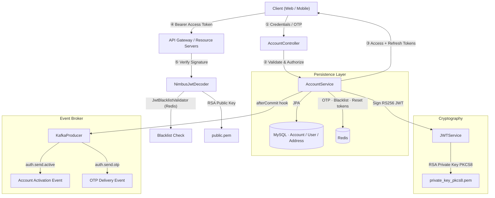
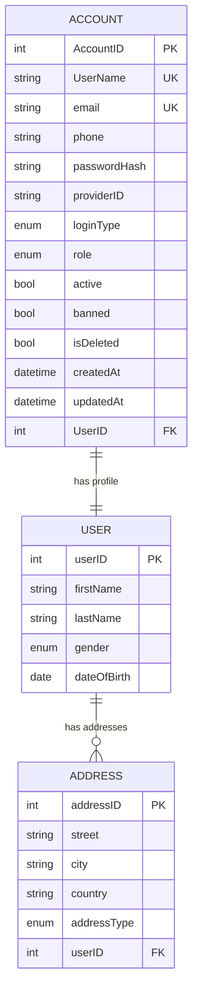

# 🔐 Furniro — Authentication & Identity Service

[](https://spring.io/projects/spring-boot)
[](https://www.oracle.com/java/)
[](https://www.mysql.com)
[](https://redis.io)
[](https://kafka.apache.org)
[](https://www.docker.com)
[](LICENSE)

> The **Authentication & Identity Service** is the central security gateway of the **Furniro E-Commerce Ecosystem**. It handles user registration, login, token management, OTP-based password recovery, role-based access control, and event-driven synchronization with downstream microservices — all built on **Spring Boot 4.0.5** with **RS256 asymmetric JWT signing**.

---

## 📑 Table of Contents

- [Architecture & Flow](#-architecture--flow)
- [Key Features](#-key-features)
- [Technology Stack](#-technology-stack)
- [Project Structure](#-project-structure)
- [Data Model](#-data-model)
- [Security Design](#-security-design)
- [Getting Started](#-getting-started)
- [Environment Variables](#-environment-variables)
- [API Reference](#-api-reference)
- [Docker](#-docker)
- [Roadmap](#-roadmap)
- [License](#-license)

---

## 🏗️ Architecture & Flow

The service uses a **decoupled asymmetric cryptography design**. The private key (PKCS#8) signs tokens; downstream services verify them independently using only the public key — no round-trip to the auth service required.



---

## 🌟 Key Features

| Feature | Detail |
|---|---|
| **RS256 JWT Tokens** | Asymmetric 2048-bit RSA signing — access (1h) & refresh (7d) tokens |
| **JWT Blacklisting** | On logout, both access and refresh token IDs (`jti`) are stored in Redis with their remaining TTL |
| **OTP Password Reset** | 6-digit OTP generated, cached in Redis with 5-min TTL, delivered via Kafka (`auth.send.otp`) |
| **Secure Reset Flow** | On OTP confirmation, a UUID reset token is issued (5-min TTL); password change requires this token |
| **RBAC** | `CUSTOMER` and `ADMIN` roles enforced via `@PreAuthorize` at method level |
| **Kafka Events** | Registration and OTP events published after transaction commit via `TransactionSynchronizationManager` |
| **Actuator** | Health, metrics, and all actuator endpoints exposed for monitoring |
| **OpenAPI / Swagger** | Interactive API docs auto-generated via Springdoc OpenAPI 3.0 |
| **Docker** | Multi-stage layered Docker build for minimal image size |

---

## 🛠️ Technology Stack

| Layer | Technology | Version |
|:---|:---|:---|
| **Framework** | Spring Boot | `4.0.5` |
| **Runtime** | Java OpenJDK | `17` |
| **Database** | MySQL + Spring Data JPA / Hibernate | `8.x` |
| **Cache / Session** | Redis (Spring Session Data Redis) | `6.x+` |
| **Message Broker** | Apache Kafka (Spring Kafka) | `3.x` |
| **Security** | Spring Security + OAuth2 Resource Server | — |
| **JWT Library** | io.jsonwebtoken (jjwt) | `0.13.0` |
| **JWT Decoder** | NimbusJwtDecoder + JwtBlacklistValidator | — |
| **Env Config** | dotenv-java (cdimascio) | `3.2.0` |
| **Code Gen** | Lombok + MapStruct | `1.18.36` / `1.6.3` |
| **API Docs** | Springdoc OpenAPI (webmvc-ui) | `3.0.1` |
| **Observability** | Spring Boot Actuator | — |
| **Build** | Maven (via Maven Wrapper) | `3.9.9` |
| **Container** | Docker (multi-stage, Alpine JRE 17) | — |

---

## 📦 Project Structure

```text
src/main/java/com/furniro/AuthService/
│
├── config/
│   ├── SecurityConfig.java          # Filter chain, JWT decoder, RBAC, whitelist
│   ├── JwtBlacklistValidator.java   # OAuth2TokenValidator — checks Redis blacklist
│   ├── KafkaConfig.java             # Kafka producer/consumer bean config
│   └── OpenApiConfig.java           # Springdoc / Swagger bean config
│
├── controller/
│   ├── AccountController.java       # /account — register, login, OTP, logout, refresh
│   ├── UserController.java          # /user — profile read & update
│   ├── AddressController.java       # /address — address read & update
│   └── AdminController.java         # /admin — admin-only account management
│
├── database/
│   ├── entity/
│   │   ├── Account.java             # Account: credentials, role, active/banned flags
│   │   ├── User.java                # User: personal details (name, gender, DOB)
│   │   └── Address.java             # Shipping/billing address linked to User
│   └── repository/                  # Spring Data JPA repositories for each entity
│
├── dto/
│   ├── API/                         # AType, ApiType, ErrorType — unified response wrappers
│   ├── req/                         # Request payloads (RegisterReq, LoginReq, ChangePasswordReq…)
│   └── res/                         # Response payloads (LoginRes…)
│
├── exception/
│   └── CustomException.java         # Domain exception + global ControllerAdvice handler
│
├── mapper/
│   └── AuthMapper.java              # MapStruct interface — entity <-> DTO mapping
│
├── service/
│   ├── AccountService.java          # Core auth logic: register, login, OTP, logout, refresh
│   ├── AdminService.java            # Admin operations: ban, unban, reset-password, bulk add
│   ├── UserService.java             # User profile CRUD
│   ├── AddressService.java          # Address CRUD
│   └── other/
│       ├── JWTService.java          # RS256 token generation, validation, claim extraction
│       ├── RedisService.java        # get / set / delete / isCaching helpers
│       └── KafkaProducer.java       # Generic JSON Kafka publisher
│
└── util/
    ├── KeyLoader.java               # PEM -> RSAPrivateKey / RSAPublicKey loader
    ├── UserUtils.java               # Unique username generator
    └── enums/
        ├── Role.java                # CUSTOMER, ADMIN
        ├── LoginType.java           # NORMAL (OAuth extension-ready)
        ├── Gender.java              # User gender enum
        └── AddressType.java         # Address type enum
```

---

## 🗄️ Data Model



---

## 🔒 Security Design

### JWT Token Claims

Each signed token carries the following custom claims:

| Claim | Description |
|:---|:---|
| `sub` | Username |
| `userID` | User entity ID |
| `accountID` | Account entity ID |
| `role` | `CUSTOMER` or `ADMIN` |
| `type` | `ACCESS` or `REFRESH` |
| `jti` | Unique token ID (used for blacklisting) |
| `iss` | Configured issuer (`JWT_ISS`) |
| `iat` / `exp` | Issued-at / Expiry timestamps |

### Token Blacklisting

On logout, **both** the access token and the refresh token are blacklisted in Redis:

```
Key:  BLACKLISTED_TOKEN:<jti>
TTL:  remaining lifetime of the token (in ms)
```

`JwtBlacklistValidator` intercepts every incoming JWT before it is granted to Spring Security — blocked tokens return `401 invalid_token`.

### OTP & Password Reset Flow

```
1. POST /account/send-otp
   → Generate 6-digit OTP
   → Cache in Redis: key=OTP:<email>, TTL=5min
   → Publish {userName, email, otp} to Kafka: auth.send.otp

2. POST /account/confirm-otp
   → Verify OTP against Redis
   → Delete OTP key (one-time use)
   → Create UUID reset token, cache: key=OTP_VERIFIED:<email>, TTL=5min
   → Return {email, resetToken} to client

3. POST /account/change-password
   → Verify resetToken against Redis
   → Encode and save new password
   → Delete OTP_VERIFIED key (replay attack prevention)
```

### Security Whitelist

The following paths bypass JWT authentication entirely:

```
/account/login        /account/register     /account/send-otp
/account/confirm-otp  /account/change-password  /account/active
/account/refresh      /v3/api-docs/**       /swagger-ui/**
/actuator/**
```

---

## 🚀 Getting Started

### Prerequisites

- **JDK 17**
- **Maven 3.8+** (or use `./mvnw`)
- **MySQL 8.0+** running on port `3306` or `3307`
- **Redis 6.x+** on port `6379`
- **Apache Kafka** on port `9092`

### 1. Clone the repository

```bash
git clone <repository-url>
cd AuthService
```

### 2. Generate RSA Key Pair

```bash
# Generate 2048-bit RSA private key
openssl genrsa -out private_key.pem 2048

# Convert to PKCS#8 format (required by Java)
openssl pkcs8 -topk8 -inform PEM -in private_key.pem -out private_key_pkcs8.pem -nocrypt

# Extract public key
openssl rsa -in private_key.pem -pubout -out public.pem
```

> [!IMPORTANT]
> Never commit `private_key_pkcs8.pem` to source control. Add it to `.gitignore`.

### 3. Configure Environment

Create a `.env` file in the project root:

```env
# ─── Server ─────────────────────────────────────────────────────────────────
SERVER_PORT=8081

# ─── Database ────────────────────────────────────────────────────────────────
DATABASE_URL=jdbc:mysql://localhost:3307/furniro_db?useSSL=false&allowPublicKeyRetrieval=true&serverTimezone=UTC
DATABASE_USERNAME=root
DATABASE_PASSWORD=your_secure_password

# ─── Redis ───────────────────────────────────────────────────────────────────
REDIS_HOST=localhost
REDIS_PORT=6379

# ─── Kafka ───────────────────────────────────────────────────────────────────
KAFKA_BOOTSTRAP_SERVERS=localhost:9092
KAFKA_CONSUMER_GROUP_ID=auth-service-group

# ─── JWT ─────────────────────────────────────────────────────────────────────
JWT_ISS=furniro-auth-service
JWT_PRIVATE=./private_key_pkcs8.pem
JWT_PUBLIC=./public.pem
JWT_ALGORITHM=RS256

# Access token: 1 hour (ms) | Refresh token: 7 days (ms)
JWT_ACCESS_EXPIRATION=3600000
JWT_REFRESH_EXPIRATION=604800000
```

### 4. Build & Run

```bash
# Run with hot-reload (devtools)
./mvnw spring-boot:run

# Or build and run the JAR
./mvnw clean package -DskipTests
java -jar target/AuthService-0.0.1-SNAPSHOT.jar
```

- **API Base:** `http://localhost:8081`
- **Swagger UI:** `http://localhost:8081/swagger-ui/index.html`
- **Actuator Health:** `http://localhost:8081/actuator/health`

---

## 🌐 API Reference

> The API Gateway routes requests under `/api/v1/furniro/auth-service/`. Direct access uses no prefix.

### 🔓 Public Endpoints — No Auth Required

| Method | Endpoint | Body / Params | Description |
|:---:|:---|:---|:---|
| `POST` | `/account/register` | `RegisterReq` | Create account + user profile; fires activation event to Kafka |
| `GET` | `/account/active` | `?id={accountID}` | Activate account via link (e.g. from email) |
| `POST` | `/account/login` | `LoginReq` | Authenticate; returns access + refresh tokens |
| `POST` | `/account/send-otp` | `{ "email": "..." }` | Generate OTP → cache in Redis (5m) → publish to Kafka |
| `POST` | `/account/confirm-otp` | `ConfirmOTPReq` | Verify OTP; returns short-lived `resetToken` |
| `POST` | `/account/change-password` | `ChangePasswordReq` | Reset password using `resetToken` |

### 🔒 Authenticated Endpoints — Bearer Token Required

| Method | Endpoint | Role | Description |
|:---:|:---|:---:|:---|
| `POST` | `/account/logout` | Any | Blacklist both access & refresh tokens in Redis |
| `POST` | `/account/refresh` | Any | Exchange refresh token for a new access token |
| `GET` | `/user/{id}` | `CUSTOMER` / `ADMIN` | Get user profile by ID |
| `GET` | `/user/all` | `ADMIN` | List all user profiles |
| `PUT` | `/user/update` | `CUSTOMER` / `ADMIN` | Update user profile (name, gender, DOB) |
| `GET` | `/address/user/{userId}` | `CUSTOMER` | Get all addresses for a user |
| `PUT` | `/address/update` | `CUSTOMER` | Create or update an address |

### 🛠️ Admin Endpoints — `ADMIN` Role Required

| Method | Endpoint | Body | Description |
|:---:|:---|:---|:---|
| `POST` | `/admin/add-accounts` | `List<AddAccountReq>` | Bulk-create accounts |
| `GET` | `/admin/all-account` | `?page&size&sortBy` | Paginated account listing |
| `POST` | `/admin/reset-password` | `List<Integer>` (IDs) | Force-reset passwords |
| `POST` | `/admin/ban-account` | `List<Integer>` (IDs) | Suspend accounts |
| `POST` | `/admin/unban-account` | `List<Integer>` (IDs) | Re-activate accounts |
| `POST` | `/admin/delete-account` | `List<Integer>` (IDs) | Soft-delete accounts |

> [!TIP]
> Test all endpoints interactively at **`http://localhost:8081/swagger-ui/index.html`**

---

## 🐳 Docker

The project ships with a **3-stage layered Dockerfile** for minimal image size:

| Stage | Base Image | Purpose |
|:---|:---|:---|
| `builder` | `maven:3.9.9-eclipse-temurin-17` | Compile & package the fat JAR |
| `extractor` | `alpine:3.19` + OpenJDK 17 JRE | Extract Spring Boot layers |
| `runtime` | `alpine:3.19` + OpenJDK 17 JRE | Serve only the application layers |

```bash
# Build the image
docker build -t furniro-auth-service .

# Run the container (pass env vars)
docker run -p 8081:8081 --env-file .env furniro-auth-service
```

The container exposes port **`8081`** and starts with Spring Boot's `JarLauncher` for optimized layered-JAR startup.

---

## 🗺️ Roadmap

### Security Hardening

- [ ] **Refresh Token Rotation (RTR)** — Invalidate old refresh token on use; issue a new one to prevent replay attacks
- [ ] **Rate Limiting** — Protect `/account/login` and `/account/send-otp` against brute-force (Bucket4j / Spring Cloud Gateway)

### Architecture

- [ ] **Transactional Outbox Pattern** — Replace `afterCommit` Kafka publishing with an outbox table for guaranteed at-least-once delivery
- [ ] **OAuth2 Social Login** — Leverage the existing `LoginType` enum and `providerID` field in `Account` for Google/GitHub login

---

## 📄 License

Distributed under the **MIT License**. See [`LICENSE`](LICENSE) for more information.
